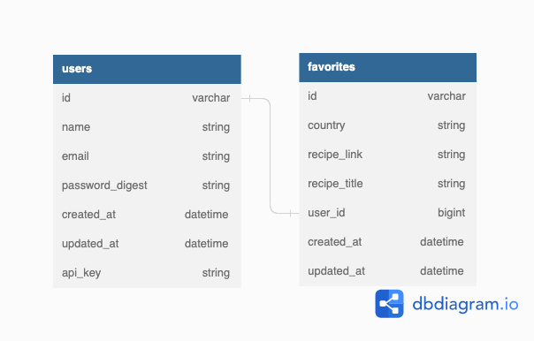

# Lunch and Learn

## About

Lunch and Learn is a project I completed for the Turing School of Software and Design. It represents the back-end API for an app which offers recipes and learning resources to its user about different geographical locations. It consumes multiple APIs including: Youtube Data API, Unsplash Images API, Edamam Recipe API, and RESTful Countries API. I then compiles the data along with user data stored in a PostgreSQL database in various endpoints for use by a hypothetical front-end team.

## Learning Goals

- Expose an API that aggregates data from multiple external APIs
- Expose an API that requires an authentication token
- Expose an API for CRUD functionality
- Determine completion criteria based on the needs of other developers
- Test both API consumption and exposure, making use of at least one mocking tool (VCR, Webmock, etc).

## Local Setup

```
# clone the repository
git clone git@github.com:musselmanth/lunch-and-learn.git

cd lunch-and-learn
bundle install

# setup the database
rails db:{create,migrate}

# run the local server
rails server
```

## Database Schema Diagram


<br>

## Available Endpoints

Base URL for requests: `http://localhost:3000/api/v1/`

---

### Get Recipes for a country

GET `/recipes`

**Optional Params:**

- country: Country name
  -if not provided a country will be chosen randomly

**Sample Response:**

```JSON
{
  "data": [
    {
      "id": null,
      "type": "recipe",
      "attributes": {
        "title": "Green Curry",
        "country": "thailand",
        "url": "https://url.to.recipe",
        "image": "https://url.to.recipe/image"
      }
    },
    **etc...**
  ]
}
```

---

### Get Learning Resource for a Country

GET `/learning_resources`

**Required Params:**

- country: Country Name

**Example Response:**

```JSON
{
  "data": {
    "id": null,
    "type": "learning_resource",
    "attributes": {
      "country": "laos",
      "video": {
        "title": "A Super Quick History of Laos",
        "youtube_video_id": "uw8hjVqxMXw"
      },
      "images": [
        {
          "alt_tag": "time lapse photography of flying hot air balloon",
          "url": "https://images.unsplash.com/photo-1540611025311-01df3cef54b5?crop=entropy&cs=tinysrgb&fit=max&fm=jpg&ixid=MnwzODAyNDd8MHwxfHNlYXJjaHwxfHxsYW9zfGVufDB8fHx8MTY2ODMxMjI4MA&ixlib=rb-4.0.3&q=80&w=1080"
        },
        **etc...**
      ]
    }
  }
}
```

---

### User Registration

POST `/users`

**Required JSON Payload Example:**

```JSON
{
  "name": "Athena Dao",
  "email": "athenadao@bestgirlever.com",
  "password": "test123",
  "password_confirmation": "test123"
}
```

**Example Response:**

```JSON
{
  "data": {
    "id": "1",
    "type": "user",
    "attributes": {
      "name": "Athena Dao",
      "email": "athenadao@bestgirlever.com",
      "api_key": "MJVHZSo2axPUkfxAGYmB4eMU"
    }
  }
}
```

**Example Response w/ Validation Errors:**

```JSON
{
  "errors": [
    {
      "title": "Invalid Attribute",
      "detail": "Name can't be blank."
    },
    {
      "title": "Invalid Attribute",
      "detail": "Email has already been taken."
    },
    {
      "title": "Invalid Attribute",
      "detail": "Password Confirmation doesn't match Password."
    }
  ]
}
```

---

### User Login

POST `/sessions`

**Required JSON payload Example:**

```JSON
{
  "email": "athenadao@bestgirlever.com",
  "password": "test123"
}
```

**Example Response:**

```JSON
{
  "data": {
    "id": "1",
    "type": "user",
    "attributes": {
      "name": "Athena Dao",
      "email": "athenadao@bestgirlever.com",
      "api_key": "MJVHZSo2axPUkfxAGYmB4eMU"
    }
  }
}
```

---

### Add User Favorite

POST `/favorites`

**Required JSON payload Example:**

```JSON
{
  "api_key": "koUY9HbjXExmvhAeQZGCk6hY",
  "recipe_link": "http://www.seriouseats.com/recipes/2009/03/cook-the-book-hani-slow-baked-pork-jerky-recipe.html",
  "recipe_title": "Korean-Style Romaine",
  "country": "south korea"
}
```

**Example Response:**

```JSON
{
  "success": "Favorite added successfully"
}
```

---

### Get a User's Favorites

GET `/favorites`

**Required Params:**

- api_key: User's API key

**Example Response:**

```JSON
{
  "data": [
    {
      "id": "1",
      "type": "favorite",
      "attributes": {
        "recipe_title": "Korean-Style Romaine",
        "recipe_link": "http://www.seriouseats.com/recipes/2009/03/cook-the-book-hani-slow-baked-pork-jerky-recipe.html",
        "country": "south korea",
        "created_at": "2022-11-15T21:10:31.348Z"
      }
    },
    **etc...**
  ]
}
```

---

### Delete a Favorite

DELETE `/favorites/<favorite_id>`

Returns a 204 status response with an empty body if the favorite was deleted successfully.
